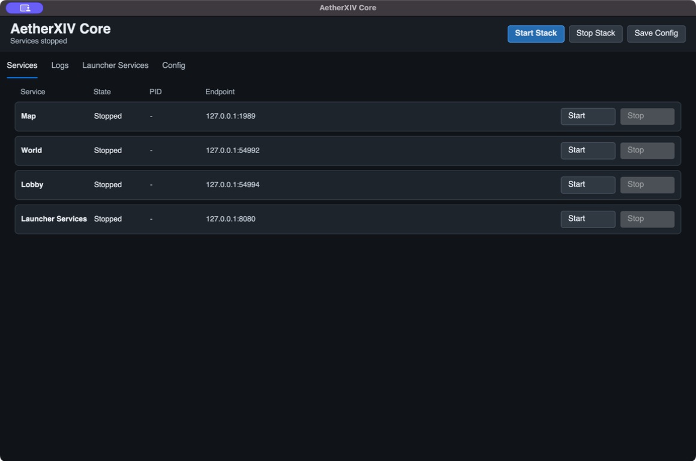
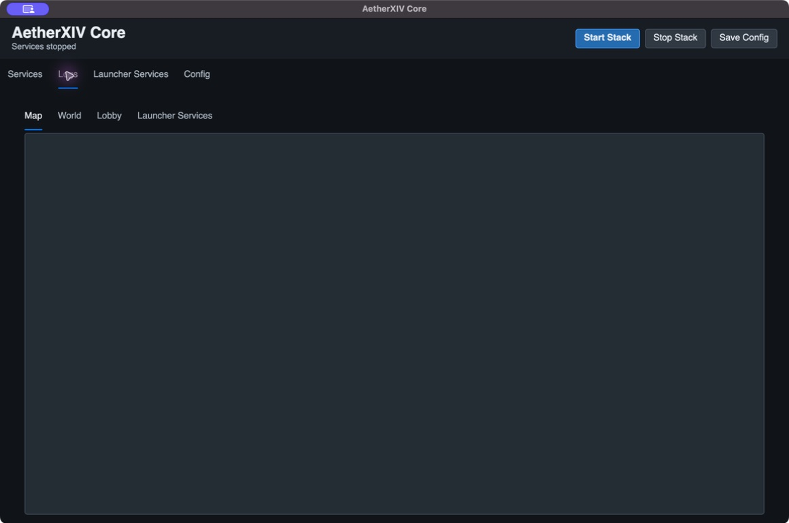
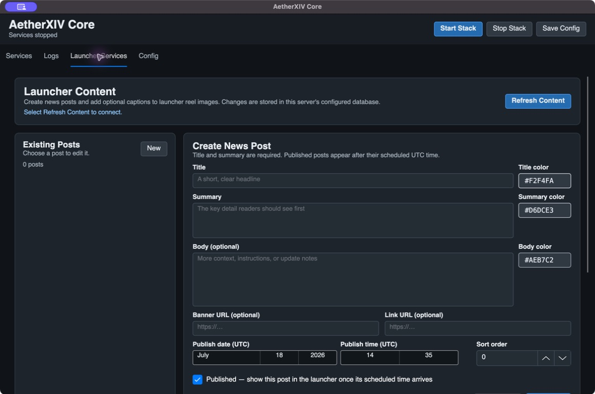
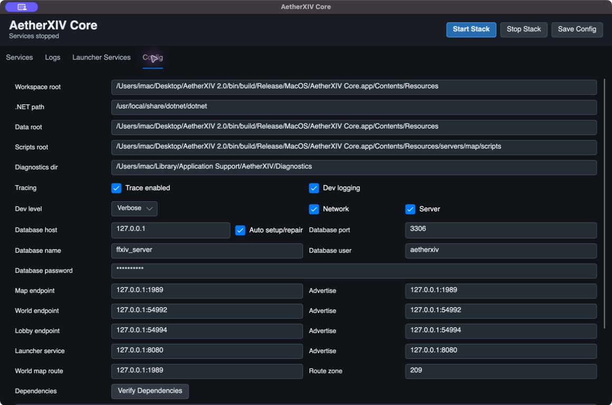

# AetherXIV Core Guide

AetherXIV Core is the graphical server-management application. It configures
the database and starts, stops, and monitors Map, World, Lobby, and Launcher
Services without displaying a shell or terminal window.

For a normal local installation, install MariaDB, open Core, verify the Config
tab, and select **Start Stack**.

## Services

The Services tab displays each service's state, process ID, and endpoint.

- **Start Stack** starts Map, World, Lobby, then Launcher Services.
- **Stop Stack** stops the services in reverse order.
- Each row can start or stop one service for focused development work.
- Closing Core stops any services it launched.

Starting the stack performs dependency and database preflight first. Core can
request MariaDB administrator credentials for first-time setup or a reviewed
migration. Those administrator credentials are not stored.

When changing endpoints or service paths, stop the affected services, save the
configuration, and start them again.

## Logs

Each service has a live output tab. The UI keeps a bounded preview so a noisy
service cannot consume memory indefinitely. Use persistent service logs or
structured diagnostics for a complete investigation rather than relying only
on the visible preview.

Map, World, and Lobby also write date-organized logs beneath their published
service folders, for example `servers/map/logs/<date>/map.log`.

## Launcher Services

This tab manages database-backed content shown by Launchers connected to this
server.

### News posts

Select **Refresh Content** to connect to the configured database. Create or edit
a post with:

- required title and summary;
- optional body, banner URL, and link URL;
- individual text colors;
- UTC publish date and time;
- sort order;
- published/draft state.

A published post appears only after its scheduled UTC time. Use **New** before
creating a separate post so an existing item is not overwritten.

### Reel image text

Core detects images in the packaged Launcher reel folder. Reel text has both a
global enable switch and a per-image enable switch. Each image can receive a
header and subtext with independent size and color. **Remove Text** removes the
database caption, not the image file.

## Config

### Paths

- **Workspace root** is the source tree or published service root.
- **.NET path** launches the framework-dependent server services.
- **Data root** supplies server data.
- **Scripts root** supplies Map Lua scripts.
- **Diagnostics dir** receives structured trace runs.

Packaged releases normally detect these paths automatically. Avoid pointing a
release at a different version's service or data folders.

### Database

The default local database is `ffxiv_server` at `127.0.0.1:3306`, using the
`aetherxiv` application account. **Auto setup/repair** lets Core create, migrate,
and verify the packaged schema after receiving administrator credentials.
This includes a completely absent database and a manually created empty schema.
An incompatible schema is backed up and replaced with the canonical database;
compatible account and character data is restored on a best-effort,
count-verified basis.

The database password is saved in Core's settings file. Never attach that file
to a public report without redacting the password. Change the development
default before operating a shared or hosted server.

### Bind and advertise addresses

The **endpoint** or bind value controls where a service listens. **Advertise**
is the address other services or clients are told to use.

- Use `127.0.0.1` for an all-in-one server used only on the same computer.
- A remote server normally binds to an appropriate interface and advertises a
  hostname or address reachable by its clients.
- Do not advertise `127.0.0.1` to remote clients.

Default ports are Map `1989`, World `54992`, Lobby `54994`, and Launcher
Services `8080`. World Map Route points World to Map; Route Zone defaults to
`209`.

### Hosted example with HTTPS Launcher Services

For a VPS where `launcher.dev.example.com` terminates HTTPS in a reverse proxy
and the internal Launcher Services port is `8087`, use:

| Core field | Value |
|---|---|
| Map endpoint / advertise | `127.0.0.1:1989` |
| World endpoint | `0.0.0.0:54992` |
| World advertise | `game.dev.example.com:54992` |
| Lobby endpoint | `0.0.0.0:54994` |
| Lobby advertise | `game.dev.example.com:54994` |
| Launcher service endpoint | `127.0.0.1:8087` |
| Launcher service advertise | `launcher.dev.example.com:443` |
| World Map Route | `127.0.0.1:1989` |

Configure the reverse proxy to preserve `/launcher` and forward it to
`http://127.0.0.1:8087`. The Launcher profile then uses
`https://launcher.dev.example.com/launcher`, server host
`game.dev.example.com`, Lobby port `54994`, and World port `54992`. Leave Patch
Base URL empty unless an actual HTTPS patch repository is being hosted.

Expose TCP `443`, `54992`, and `54994`. Keep `3306`, `1989`, and the proxy-only
`8087` private. If Launcher Services is deliberately exposed directly instead
of through HTTPS, bind it to `0.0.0.0:8087` and use an explicit
`http://host:8087/launcher` URL; this is not recommended for public account
credentials.

### Diagnostics

**Trace enabled** creates a separate run directory and writes structured JSONL
files for supported Map, World, and Lobby events. Regular service logs remain
available independently. The additional development logging controls are
development-facing; when collecting a report, rely on files actually produced
for that run rather than assuming every filter creates a separate file.

### Verify Dependencies

This checks the published/source layout, server executables, runtime, paths, and
other prerequisites without starting the stack. Resolve failed checks from top
to bottom.

## Configuration location

Core stores `core-settings.json` under the platform application-data folder:

- Windows: `%APPDATA%\AetherXIV\Core\core-settings.json`
- macOS: `~/Library/Application Support/AetherXIV/Core/core-settings.json`
- Linux/SteamOS: the application-data equivalent for `AetherXIV/Core`

Treat this file as a credential-bearing configuration file.

For database safety and recovery, read
[Database Setup, Updates, and Recovery](DATABASE_SETUP_AND_MIGRATION.md).
