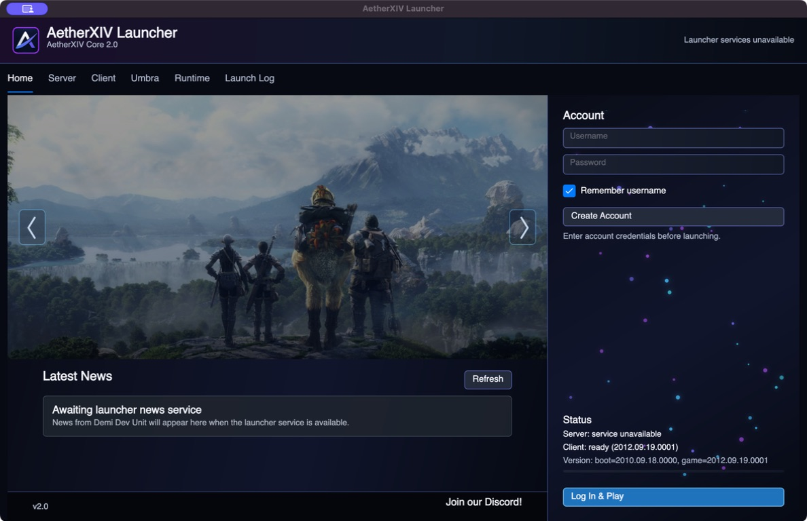
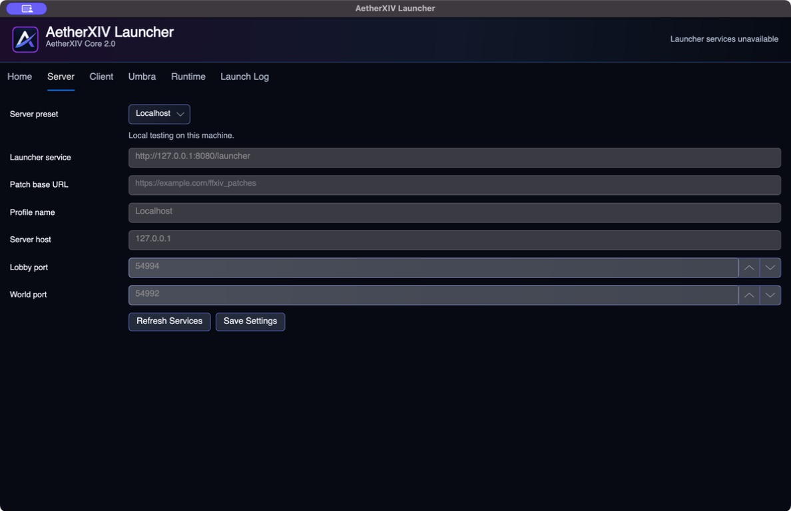
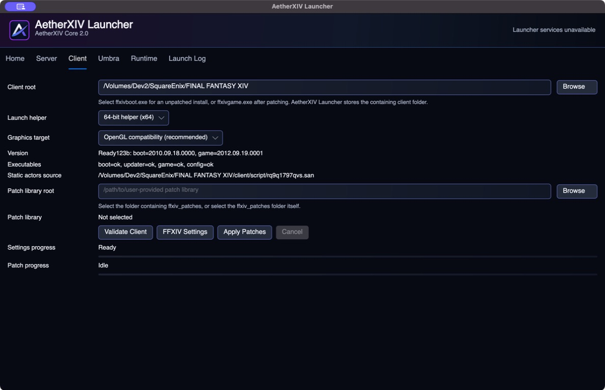
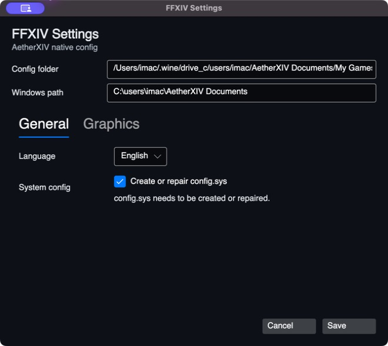
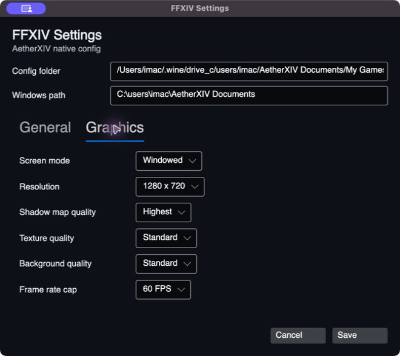
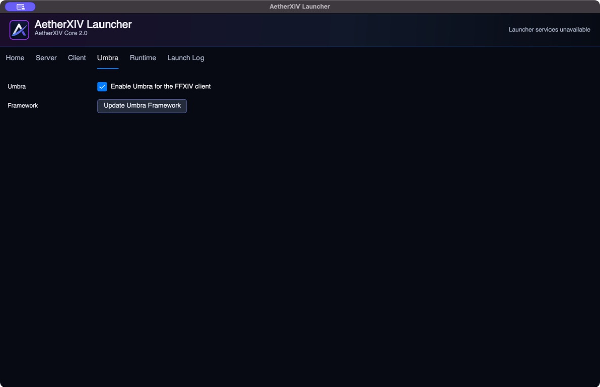
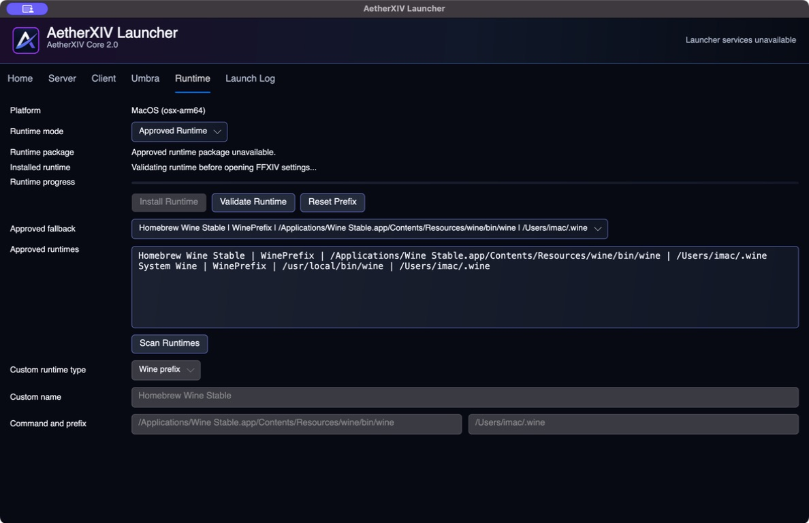
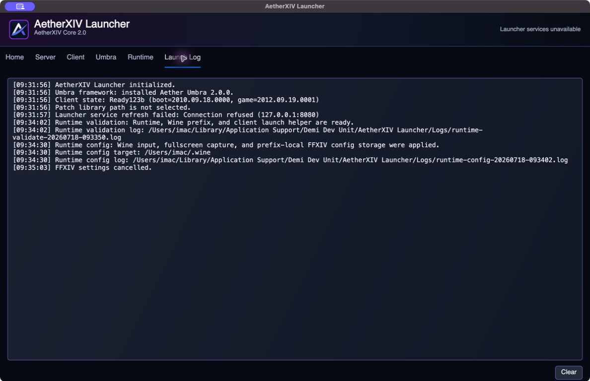

# AetherXIV Launcher Guide

AetherXIV Launcher validates and configures a user-owned Final Fantasy XIV
1.23b client, connects it to an AetherXIV server, manages cross-platform launch
runtimes, and optionally installs Umbra. It is a graphical application and does
not expose a shell or terminal window during normal launch.

## Home

The Home tab is the normal starting point after setup.

- The image reel and its captions come from Launcher Services.
- **Account** accepts the username and password used by the selected server.
- **Remember username** stores only the username. The Launcher does not save the
  account password in its profile.
- **Create Account** is available only when the selected Launcher Service allows
  registration.
- **Status** reports Launcher Services availability, client readiness, and the
  detected boot/game versions.
- **Log In & Play** validates the configuration, authenticates, prepares the
  runtime, selects the launch helper, prepares Umbra when enabled, and starts
  the game.
- **Latest News** is supplied by the configured Launcher Service.

If **Log In & Play** is unavailable or fails, resolve the first failing status
or validation message before changing unrelated settings.

## Server

Choose the destination that owns accounts, news, patches, and game services.

- **Localhost** targets AetherXIV Core on the same computer.
- **Demi Dev Unit Developer Server** uses the maintained developer-service
  preset.
- **Custom Server Setup** unlocks all endpoint fields for another server.

The Launcher Service URL handles account and presentation requests. Patch Base
URL identifies server-provided patch metadata. Server host, Lobby port, and
World port are passed to the client launch workflow.

Select **Refresh Services** to test the configured service, then **Save
Settings**. Preset-controlled values remain locked to prevent accidental drift;
choose the custom preset to edit them.

For a remote server, use an address clients can actually reach. `127.0.0.1`
always means the Launcher's own computer.

For a typical public VPS behind an HTTPS reverse proxy, Launcher Service is the
public URL including its `/launcher` route, for example
`https://launcher.dev.example.com/launcher`. Server host is the public game
hostname without `https://`; Lobby and World use their direct TCP ports. Patch
Base URL can remain empty unless the operator hosts a real patch repository.

## Client

### Select and validate the client

Use **Browse** beside Client root and select:

- `ffxivboot.exe` for an unpatched installation; or
- `ffxivgame.exe` after the client has been patched.

The Launcher saves the containing client folder. **Validate Client** checks the
supported version state, required executables, and the static-actors source.
The game must report the supported 1.23b version before launch.

### Launch helper

**Automatic** is recommended. Choose x86 or x64 only when diagnosing helper or
runtime compatibility. The helper is not the architecture of the legacy game
itself; Umbra's native bootstrap remains x86.

### Graphics target

- **OpenGL compatibility** is the recommended cross-platform starting point.
- **Wine default** leaves graphics selection to the runtime.
- **OpenGL threaded** is experimental.
- **WineD3D Vulkan** is experimental and should be used only with a compatible
  runtime and graphics stack.

Change one graphics target at a time and keep its Launch Log when reporting a
regression.

### Patch library

AetherXIV does not supply Square Enix patches. Select a user-provided folder
containing `ffxiv_patches`, or the `ffxiv_patches` folder itself. Validate the
library before **Apply Patches**. Do not interrupt an active patch operation;
use **Cancel** when available and retain its log if it fails.

### FFXIV Settings

The settings workflow validates the native or Wine-hosted configuration path
before opening. On macOS/Linux, this can take several seconds while the runtime
and prefix are checked.

The **General** tab chooses the language and can create or repair `config.sys`.

The **Graphics** tab controls screen mode, resolution, shadow-map quality,
texture quality, background quality, and frame-rate cap. Existing configuration
files are backed up when settings are saved.

## Umbra

- **Enable Umbra for the FFXIV client** adds the verified framework to the
  launch sequence.
- **Update Umbra Framework** installs or refreshes the framework payload.

Umbra is accepted only when its downloaded/catalog payload and the supported
client executable identity pass verification. An unknown client hash blocks
injection rather than attempting an unsafe match.

For plugin installation, capabilities, the developer bridge, and SDK usage,
read the [Umbra SDK](UMBRA_SDK.md).

## Runtime

Windows launches the game natively. macOS, Linux, and SteamOS use this tab to
manage a Wine-compatible runtime.

### Automatic Wine

This is the recommended mode. The game server is not a runtime package host.
The Launcher selects a built-in package definition for its operating system
and architecture. Each definition pins the upstream URL, byte length, SHA-256,
archive layout, and Wine executable path. Use:

- **Install Runtime** to download, verify, extract, and validate the pinned
  managed Wine package;
- **Scan Runtimes** after installation to detect recognized local Wine paths;
- **Verify Dependencies** to check the selected runtime's platform libraries
  without recreating its prefix;
- **Validate Runtime** to test the runtime, prefix, and helper.

The managed install is stored in Launcher application data and does not run
Homebrew, `apt`, `pacman`, or another privileged package manager. A checksum,
size, extraction, or validation failure stops the install. A runtime is not
considered ready until validation confirms its version, creates or checks the
managed prefix, and successfully runs the bundled client helper.

Validation also checks host prerequisites before Wine starts. On Apple silicon,
the Launcher runs an Intel-process probe that causes macOS to offer its normal
Rosetta installation prompt when Rosetta is absent. The Launcher waits up to ten
minutes for that Apple-managed installation before continuing. It never accepts
the Rosetta license silently. On Linux, validation checks the selected Wine
loader and Wine server with `ldd`, then validates Wine itself and the bundled
launch helper. Wine driver modules are intentionally left to Wine's loader;
probing them directly reports Wine's own `ntdll.so` and `win32u.so` as missing
on otherwise valid distribution installs. Real missing host library names and
distribution-family guidance are shown in the Runtime status and Launch Log.
**Verify Dependencies** offers an explicit
administrator-authenticated install on supported Debian/Ubuntu, Arch, and
Fedora-family systems, then automatically repeats verification. It does not
install anything unless the user accepts the prompt. SteamOS remains on the
persistent-environment guidance path because changing its immutable system
image would not survive an operating-system update.

The recommended OpenGL compatibility target forces WineD3D's OpenGL renderer
but leaves Wine's supported command-stream default enabled. The threaded mode
forces that setting explicitly; Wine default leaves the complete WineD3D
configuration untouched; and WineD3D Vulkan remains an experimental fallback.

Automatic detection recognizes Wine Stable at its standard macOS application
path and `wine` or `wine64` executables available on `PATH`. Detected Wine uses
the isolated AetherXIV FFXIV prefix under Launcher application data, not the
user's global `~/.wine` prefix. If a valid runtime lives elsewhere, use Custom
Runtime and select its exact executable.

The 2.0 managed definitions use Wine 11.0 builds for macOS arm64/x64 and Linux
x64. SteamOS uses the Linux x64 package in persistent Launcher storage. On
Apple silicon, the macOS package contains Intel components and requires
Rosetta. GStreamer is optional on macOS: Wine and the game can launch without
it, but some movies or media may not play. The Launcher reports that warning
without downloading the upstream unsigned installer. Platform setup guidance
remains the fallback when a prerequisite is missing or no managed artifact is
defined for the detected RID.

### Custom Runtime

Custom mode accepts a Wine command or executable and an optional prefix. It is
for advanced users who can identify the exact runtime and take responsibility
for its compatibility. A random prefix is not automatically treated as a
validated runtime.

### Reset Prefix

**Reset Prefix** removes the Launcher-managed compatibility environment so it
can be recreated. It can discard Wine-side settings and installed components.
Back up anything important in the managed prefix before using it. It does not
delete the Final Fantasy XIV client folder itself.

## Launch Log

The in-app log shows the current session. **Clear** clears the visible log; it
does not repair the underlying failure.

Persistent Launcher data is stored under `Demi Dev Unit/AetherXIV Launcher` in
the platform application-data folder:

- Windows: `%APPDATA%\Demi Dev Unit\AetherXIV Launcher`
- macOS: `~/Library/Application Support/Demi Dev Unit/AetherXIV Launcher`
- Linux/SteamOS: `$XDG_DATA_HOME/Demi Dev Unit/AetherXIV Launcher`, or
  `~/.local/share/Demi Dev Unit/AetherXIV Launcher`

Important children include `Logs`, `Runtimes`, `RuntimeCache`,
`Prefixes/ffxiv-1x`, and `Umbra/Logs`. A game launch log can have a companion
`.helper.log`. Runtime validation and configuration also write logs here.

See [Debugging and Bug Reporting](DEBUGGING_AND_BUG_REPORTING.md) before sharing
logs or configuration files.
